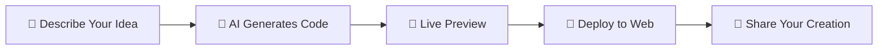

# ⚡ GenZai - Prompt to Product

<div align="center">
  
  
  **AI-Powered Vibe Coding Platform for Gen Z Developers**
  
  [](https://genzai.in)
  [](LICENSE)
  
  *From idea to deployment in minutes, not hours* ⚡
</div>

---

## 🚀 What is GenZai?

GenZai is a revolutionary AI-powered development platform that transforms the way Gen Z developers code. Skip the boilerplate, ditch the setup headaches, and go straight from prompt to production-ready applications.

**Perfect for:**
- 🎯 Rapid prototyping
- 💡 MVP development
- 🎨 Creative coding experiments
- 📚 Learning new technologies
- ⚡ Weekend hackathons

## ✨ Key Features

### 🧠 AI-Powered Code Generation
- **Natural Language to Code**: Describe what you want, get working code instantly
- **Context-Aware**: Understands your project structure and coding style
- **Multi-Language Support**: JavaScript, Python, React, Vue, and more

### 🎨 Vibe Coding Experience
- **Live Preview**: See your changes in real-time
- **Interactive Development**: Code, preview, iterate seamlessly
- **Modern UI**: Clean, distraction-free coding environment

### 🚀 One-Click Deployment
- **Instant Hosting**: Deploy to the web with a single click
- **Production Ready**: Optimized builds and performance
- **Custom Domains**: Connect your own domain effortlessly

### 🔧 Developer-Friendly Tools
- **Smart Autocomplete**: AI-enhanced code suggestions
- **Error Detection**: Real-time bug catching and fixes
- **Version Control**: Built-in Git integration

## 🛠️ How It Works



1. **Prompt**: Tell GenZai what you want to build
2. **Generate**: AI creates clean, production-ready code
3. **Preview**: See your app come to life instantly
4. **Deploy**: Push to production with one click
5. **Share**: Show off your creation to the world

## 💻 Technology Stack

<div align="center">

| Frontend | Backend | AI/ML | Deployment |
|----------|---------|--------|------------|
| React | Node.js | OpenAI GPT | Vercel |
| TypeScript | Express | Anthropic Claude | Netlify |
| Tailwind CSS | MongoDB | Custom Models | AWS |
| Vite | Redis | LangChain | Docker |

</div>

## 📸 Screenshots

<div align="center">
  
### 🎨 Code Generation in Action


### 📱 Live Preview


</div>

## 🎯 Use Cases

### 🎨 Creative Projects
```bash
"Create a portfolio website with dark mode and smooth animations"
```

### 📊 Data Visualization
```bash
"Build a dashboard showing cryptocurrency prices with interactive charts"
```

### 🎮 Mini Games
```bash
"Make a simple 2D platformer game with HTML5 Canvas"
```

### 🛒 E-commerce
```bash
"Create a product landing page with payment integration"
```

## 🚀 Getting Started

### 1. Visit GenZai Platform
```bash
🌐 Open https://genzai.in in your browser
```

### 2. Start Your First Project
```bash
📝 Click "New Project" and describe your idea
🤖 Watch AI generate your code instantly
👀 Preview your app in real-time
🚀 Deploy with one click
```

### 3. Local Development (Optional)
```bash
# Clone the repository
 Coming Soon...
```

## 🤝 Contributing

We love contributions from the community! GenZai is built by Gen Z developers, for Gen Z developers. Join Our Discord to contribute into Genzai

### 📝 Code Style
- Use TypeScript for type safety
- Follow ESLint configuration
- Write tests for new features
- Use conventional commits

### 🎯 Areas We Need Help
- 🤖 AI model improvements
- 🎨 UI/UX enhancements
- 🔧 New framework integrations
- 📚 Documentation and tutorials
- 🌍 Internationalization


### 🎯 Coming Soon
- [ ] **Mobile App** - Code on the go
- [ ] **Team Collaboration** - Real-time multiplayer coding
- [ ] **AI Pair Programming** - Advanced code assistance
- [ ] **Custom Templates** - Save and share project templates
- [ ] **API Integrations** - Connect with popular services

### 🌟 Future Vision
- [ ] **Voice Coding** - Speak your code into existence
- [ ] **AR/VR Support** - Code in virtual environments
- [ ] **Blockchain Integration** - Web3 and smart contracts
- [ ] **IoT Project Support** - Hardware integration

## 📝 License

This project is licensed under the MIT License - see the [LICENSE](LICENSE) file for details.

## 🙏 Acknowledgments

- 🤖 **OpenAI** for GPT models
- 🧠 **Anthropic** for Claude AI
- 💻 **Vercel** for deployment platform
- 🎨 **Tailwind CSS** for styling
- 🚀 **React** team for the framework
- 💜 **Gen Z Developer Community** for feedback and support

## 💬 Support & Contact

<div align="center">

### 🔗 Connect with GenZai

[](https://genzai.in)
[](https://discord.gg/genzai)
[](https://twitter.com/genzai_dev)
[](mailto:hello@genzai.in)

### 💡 Questions? Issues? Ideas?
- 🐛 **Bug Reports**: [Create an Issue](https://github.com/GenZaiBharat/genzai/issues)
- 💡 **Feature Requests**: [Start a Discussion](https://github.com/GenZaiBharat/genzai/discussions)
- 📧 **General Inquiries**: hello@genzai.in
- 💬 **Community Chat**: [Join Discord](https://discord.gg/genzai)

</div>

---

<div align="center">
  
**⚡ Built with ❤️ by Gen Z developers, for Gen Z developers**

*Transform your ideas into reality at lightning speed with GenZai*

**[Start Building Now →](https://genzai.in)**

</div>
